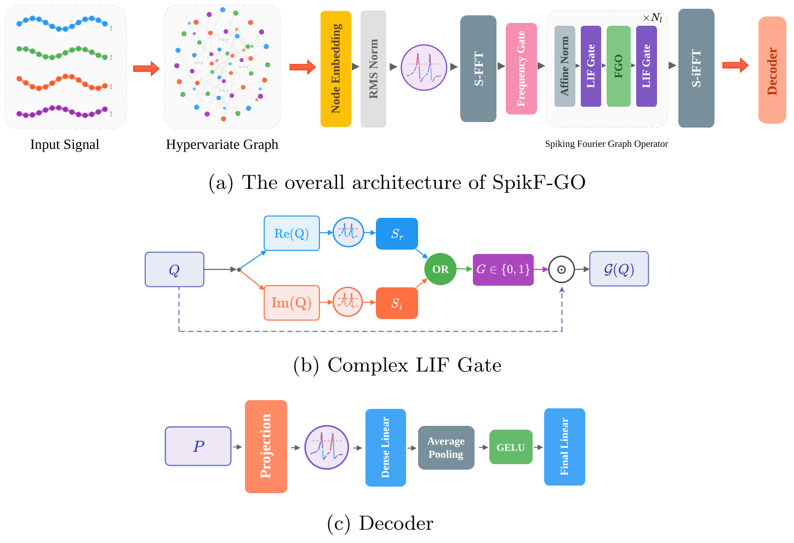

# SpikF-GO: Spiking Fourier Graph Operators

Official implementation of **SpikF-GO: Spiking Fourier Graph Operators for Multivariate Time Series Forecasting**, accepted to the **ECML PKDD 2026 Research Track**.

SpikF-GO is a spiking neural architecture for multivariate time series forecasting. It combines the hypervariate graph formulation of FourierGNN with spike-driven Fourier-domain graph processing, enabling joint modeling of intra-series temporal dependencies, inter-series dependencies, and time-varying cross-variable interactions. The model introduces sparse frequency selection and Complex LIF-based spectral gating to preserve event-driven computation in the Fourier domain. We also provide **SpikF-GO w/ CPG**, which incorporates Central Pattern Generator-based positional signals for improved long-range temporal modeling.



This repository contains the code, scripts, and configuration files used for the ECML PKDD 2026 paper.

## Contributions

- **Graph-based SNN forecasting:** SpikF-GO brings hypervariate graph modeling into SNN-based multivariate time series forecasting.
- **Spike-driven Fourier graph operators:** The model combines sparse frequency gating with Complex LIF-based spectral processing to preserve event-driven computation in the Fourier domain.
- **Unified SNN benchmark:** We evaluate SpikF-GO against major SNN forecasting families under a common experimental protocol across eight benchmark datasets.
- **Energy-aware forecasting:** SpikF-GO achieves competitive-to-superior forecasting performance while reducing theoretical energy consumption relative to FourierGNN.

## Related Library: SpikingTSF

We also maintain **[SpikingTSF](https://github.com/spikora/SpikingTSF)**, an open-source benchmark library for spiking neural network based time-series forecasting.

SpikingTSF aims to unify SNN forecasting architectures and ANN baselines under a common training and evaluation protocol, making it easier to compare models fairly across datasets, horizons, metrics, and random seeds.

> Note: This repository contains the implementation for the SpikF-GO paper. SpikingTSF is a broader benchmarking library and may not reproduce all experiments in this repository directly.

---

## Overview

- **`train.py`** — main entry point for training and evaluating models.
- **`model/`** — model implementations, including SpikF-GO and the baselines used in the paper (SpikF, FourierGNN, Spikformer/iSpikformer, TS-Former/TS-GRU/TS-TCN, SpikeGRU/SpikeRNN/SpikeTCN, and the CPG variants).
- **`utils/`** — shared utilities (metrics, helpers, etc.).
- **`data/`** — dataset loading code (`data_loader.py`); raw dataset files are placed here at runtime and are not tracked by git.
- **`scripts/`** — shell scripts to reproduce experiments for each dataset used in the paper.
- **`assets/`** — architecture figure and supplementary material.

---

## Repository Structure

```
SpikF-GO/
├── README.md
├── LICENSE
├── CITATION.cff
├── requirements.txt
├── train.py
├── model/
├── utils/
├── data/
│   └── data_loader.py
├── scripts/
│   ├── ecg.sh
│   ├── covid.sh
│   ├── solar.sh
│   ├── ecl.sh
│   ├── traffic.sh
│   ├── metr_la.sh
│   ├── pems_bay.sh
│   └── wiki.sh
└── assets/
    ├── spikf-go-architecture.png
    └── supplementary.pdf
```

---

## Environment Setup

Create and activate a virtual environment.

### Linux / macOS

```bash
python3 -m venv venv
source venv/bin/activate
```

### Windows

```bash
python -m venv venv
venv\Scripts\activate
```

Install the required dependencies:

```bash
pip install -r requirements.txt
```

Experiments in the paper were run with **PyTorch 2.5.1** on a single **NVIDIA RTX 4090**.

---

## Dataset

Download the processed datasets from Figshare:

https://figshare.com/s/7617530bce306584fe95?file=62576929

After downloading, place the dataset files **directly** inside the existing `data/` folder.

**Important**

* Do **not** create subfolders inside `data/`.
* Place each dataset file individually in `data/`.

### Expected structure

```
SpikF-GO/
│── data/
│   │── dataset_file_1
│   │── dataset_file_2
│   │── ...
│── model/
│── utils/
│── scripts/
│── requirements.txt
│── train.py
│── README.md
```

---

## Run Experiments

Run scripts are located in the `scripts/` folder, one per dataset:

```bash
bash scripts/ecg.sh
bash scripts/covid.sh
bash scripts/solar.sh
bash scripts/ecl.sh
bash scripts/traffic.sh
bash scripts/metr_la.sh
bash scripts/pems_bay.sh
bash scripts/wiki.sh
```

If needed, make a script executable first:

```bash
chmod +x scripts/ecl.sh
./scripts/ecl.sh
```

---

## Reproducing the ECML PKDD 2026 Results

1. Download the processed datasets from [Figshare](https://figshare.com/s/7617530bce306584fe95?file=62576929).
2. Place all dataset files directly under `data/`.
3. Run the dataset-specific script(s) in `scripts/` corresponding to the experiments you want to reproduce, e.g.:

```bash
bash scripts/ecl.sh
```

Each script sets the hyperparameters and configuration used to produce the corresponding results reported in the paper.

---

## Supplementary Material

The supplementary material is available at [`assets/supplementary.pdf`](assets/supplementary.pdf).

---

## Citation

If you use this code or build on SpikF-GO, please cite our paper:

```bibtex
@inproceedings{bakhshaliyev2026spikfgo,
  title     = {SpikF-GO: Spiking Fourier Graph Operators for Multivariate Time Series Forecasting},
  author    = {Bakhshaliyev, Jafar and Landwehr, Niels},
  booktitle = {ECML PKDD},
  year      = {2026}
}
```

See [`CITATION.cff`](CITATION.cff) for citation metadata.

---

## Acknowledgements

The baselines in `model/` build on ideas and, where applicable, implementation components from the following prior work. We thank the authors for releasing their code and papers, and the original licenses are respected.

- **`SpikF.py`** — adapted from **SpikF** (Wu, Huo & Chen, *"SpikF: Spiking Fourier Network for Efficient Long-term Prediction"*, [ICML 2025 / PMLR v267](https://proceedings.mlr.press/v267/wu25m.html)).
- **`TS_Former.py`, `TS_GRU.py`, `TS_TCN.py`** — adapted from the two-compartment **TS-LIF** models (Feng, Feng, Gao, Zhao & Shen, *"TS-LIF: A Temporal Segment Spiking Neuron Network for Time Series Forecasting"*, [arXiv:2503.05108](https://arxiv.org/abs/2503.05108)).
- **`iSpikformer.py`, `SpikeGRU.py`** — adapted from the **SeqSNN** baselines (Lv, Wang, Han, Zheng, Huang & Li, *"Efficient and Effective Time-Series Forecasting with Spiking Neural Networks"*, [arXiv:2402.01533](https://arxiv.org/abs/2402.01533)), [microsoft/SeqSNN](https://github.com/microsoft/SeqSNN).
- **`SpikeRNN_CPG.py`, `SpikeTCN_CPG.py`, `Spikformer_CPG.py`** — the Central Pattern Generator (CPG) variants build on [arXiv:2405.14362](https://arxiv.org/abs/2405.14362)/ [microsoft/SeqSNN](https://github.com/microsoft/SeqSNN)

- **`FourierGNN.py`** — adapted from **FourierGNN**, [arXiv:2311.06190](https://arxiv.org/abs/2311.06190)/ [aikunyi/FourierGNN](https://github.com/aikunyi/FourierGNN)

---

## License

This project is released under the [MIT License](LICENSE).
